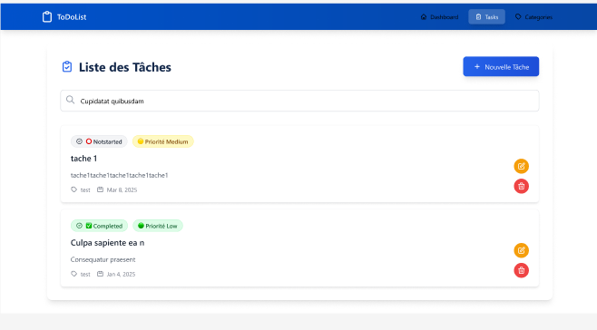
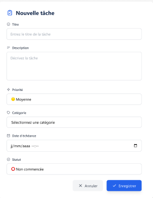
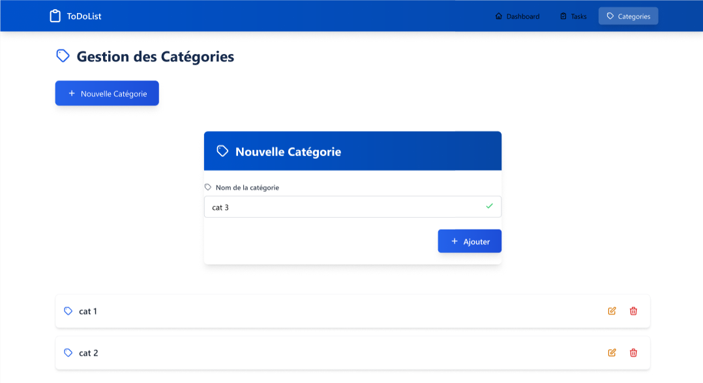
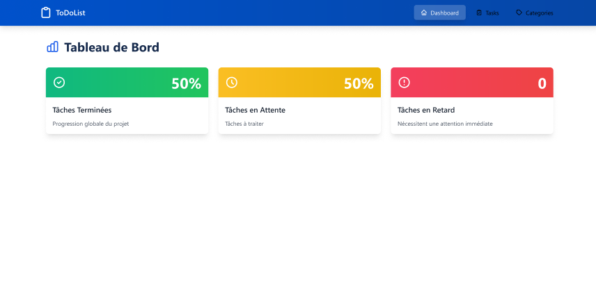

# 📋 ToDoList Application - Angular 17 🚀

## 🌟 Description du Projet
Cette application **ToDoList** offre une solution complète et personnalisable pour gérer vos tâches et leurs catégories. Avec une interface intuitive et réactive, elle permet de créer, modifier, supprimer, et rechercher des tâches efficacement. Un tableau de bord interactif fournit des statistiques pour un suivi rapide et précis.

---

## 🛠️ Fonctionnalités Principales

### 📌 Gestion des Tâches
- **Ajout de tâches** avec :
  - Titre
  - Description (optionnelle)
  - Date et heure d'échéance (format européen)
  - Niveau de priorité : Haute, Moyenne, Basse
  - Statut : Terminé, En cours, Pas commencé
- **Modification et suppression** des tâches existantes.
- **Recherche en temps réel** par titre ou description.

### 📂 Gestion des Catégories
- Ajout, modification et suppression de catégories (e.g., Travail, Personnel, Courses).
- Chaque tâche appartient à une seule catégorie.
- Prévention des doublons de catégories.

### 📊 Tableau de Bord Statistique
- Pourcentage des tâches accomplies.
- Pourcentage des tâches non accomplies.
- Nombre de tâches en retard (date d’échéance dépassée).

### ✅ Validations Intégrées
- Empêcher les dates d’échéance dans le passé.
- Limiter la longueur des titres et descriptions.
- Éviter les doublons de catégories.

### 🖥️ Interface Utilisateur
- **Responsive** : Compatible avec les écrans d’ordinateur et les appareils mobiles.
- **Intuitive** : Conçue pour une navigation fluide et ergonomique.

---

## 🛠️ Technologies Utilisées
- **Frontend Framework** : Angular 17
- **Styles** : SCSS avec Tailwind
- **Approche Technique** :
  - **Components** : Liste des tâches, catégories, formulaires, dashboard.
  - **Modules** : Organisation modulaire pour une meilleure maintenabilité.
  - **Services** : Communication entre components.
  - **Routing** : Navigation entre les différentes pages.
  - **Form Handling** : Gestion des formulaires d'ajout/modification.
  - **Observables** : Mise à jour en temps réel des données.
  - **Databinding** : Synchronisation des données avec l’interface.
  - **Pipes** : Formatage des dates et filtres.

---

## 🚀 Installation et Lancement

### 1️⃣ Prérequis
- **Node.js** (v16 ou plus récent)
- **Angular CLI** (v17)

### 2️⃣ Installation
1. Clonez le dépôt :
   ```bash
   git clone https://github.com/asmaabarj/TodoList.git
   cd TodoList

2. Installez les dépendances :
 ```bash
 npm install
```
3. Lancer l'Application :
* Environnement de développement :
 ```bash
ng serve
```
Accédez à l’application sur http://localhost:4200

# 🖼️ Aperçu de l'Application

---

## 🌈 Page Principale
La page principale offre une vue claire et organisée des tâches avec une barre de recherche pour faciliter la navigation et la gestion rapide des tâches.

### 🔍 Liste des Tâches et Recherche
- Affiche toutes les tâches classées par catégorie.
- Barre de recherche permettant de filtrer les tâches par **titre** ou **description**.
- Indicateurs visuels pour :
  - Niveau de priorité (haute, moyenne, basse).
  - Statut de complétion (terminé, en cours, pas commencé).


---

## 📂 Gestion des Catégories
Une interface dédiée pour gérer les catégories de manière simple et efficace.

### ⚙️ Fonctionnalités
- **Création de Catégories** : Ajoutez des catégories personnalisées comme "Travail", "Personnel", "Courses", etc.
- **Modification des Catégories** : Changez le nom des catégories existantes.
- **Suppression de Catégories** : Supprimez les catégories inutilisées (avec confirmation pour éviter les erreurs).

---

## 📊 Tableau de Bord
Le tableau de bord offre une vue interactive des statistiques sur l'état des tâches.

### 📈 Statistiques Incluses
- **Pourcentage de Tâches Accomplies** : Indique le pourcentage des tâches terminées.
- **Pourcentage de Tâches Non Accomplies** : Montre les tâches encore en attente.
- **Nombre de Tâches en Retard** : Compte les tâches dont la date d'échéance est dépassée.

---

## 📋 Planification sur Jira
- Lien vers le tableau Jira : [Accéder à Jira](https://asmaabarj5.atlassian.net/jira/software/projects/TOD/boards/397/backlog?epics=visible)

## 🎨 Lien de Maquettage sur Figma
  - [Voir le projet sur Figma](https://www.figma.com/design/a7qgsSmCnpkWfgfI0GlAy8/ToDoList?node-id=0-1&t=ESnbaEkZcZ9pSxr0-1)


